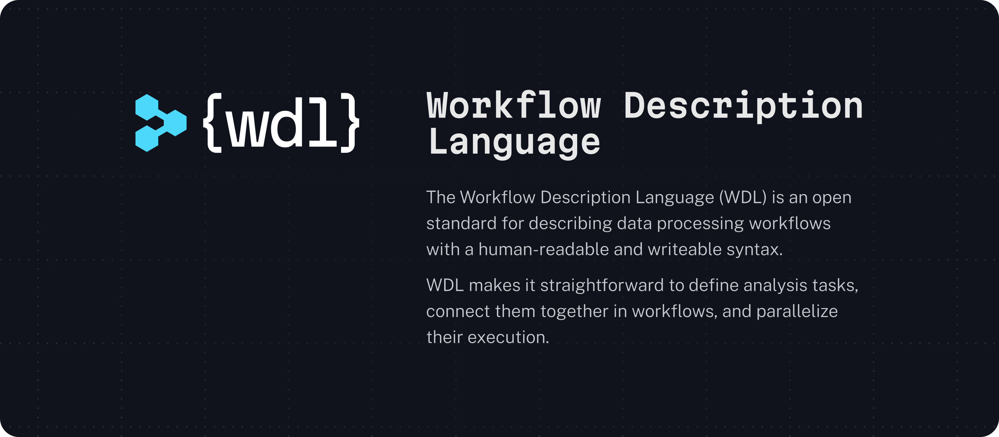

  

 

## Important Links

- You can find the official language specification in `openwdl/wdl`
  ([repository][spec-repo]).
- You can learn more about the OpenWDL organization by visiting the about page
  on the website ([website][website-about]).
- You can find the documentation for WDL in `openwdl/docs`
  ([repository][docs-repo], [website][docs-site]).
  - Use the [Quickstart guide][quickstart-guide] to quickly come up to speed on
    how to use WDL.
  - Use the [Ecosystem guide][ecosystem-guide] to learn about execution engines
    and developer tools that are available.
- You can learn more about the governance structure by visiting
  `openwdl/governance` ([repository][governance-repo]).
- You can join the community on **Slack** [here][slack-invite].

[docs-repo]: https://github.com/openwdl/docs
[docs-site]: https://docs.openwdl.org
[ecosystem-guide]: https://docs.openwdl.org/getting-started/ecosystem.html
[governance-repo]: https://github.com/openwdl/governance
[quickstart-guide]: https://docs.openwdl.org/getting-started/quickstart.html
[slack-invite]:
    https://join.slack.com/t/openwdl/shared_invite/zt-ctmj4mhf-cFBNxIiZYs6SY9HgM9UAVw
[spec-repo]: https://github.com/openwdl/wdl
[website-about]: https://openwdl.org/about/
